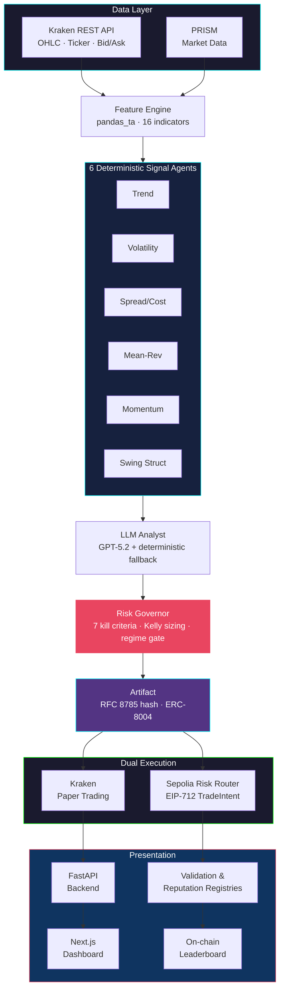

# Praxis Agent

**Where theory becomes execution.**

A regime-adaptive AI trading agent built around a single principle the SOTA red-team literature keeps validating: **the LLM is a bounded analyst, not an executor**. Every position, every kill switch, every dollar of sizing is owned by a deterministic risk engine. Every decision is hashed to an artifact, attested on Sepolia, and auditable on Etherscan.

Built for the [lablab.ai AI Trading Agents Hackathon](https://lablab.ai/ai-hackathons/ai-trading-agents) — combined Kraken CLI + ERC-8004 submission.

> **Disclaimer:** This is an experimental research project. Not financial advice. See [DISCLAIMER.md](DISCLAIMER.md) for full details.

---

## Backtest Results

### Out-of-Sample (Jan 2023 - Apr 2026, unseen data)

| Metric | Value |
|---|---|
| Sharpe Ratio | **1.136** |
| CAGR | **14.21%** |
| Total Return | **+52.59%** |
| Calmar Ratio | **1.479** |
| Max Drawdown | **9.61%** |
| Total Trades | 53 (31W / 22L) |
| Win Rate | 58.5% |
| Profit Factor | 2.648 |
| Expectancy | $114.00/trade |
| MC p-value | 0.013 |
| PSR | 99.4% |

### Methodology

- **12+ years of FMP data** — BTC/USD (2013-2026) and ETH/USD (2015-2026) on 4h candles.
- **Strict IS/OOS separation** — parameters optimized on pre-2023 data only. OOS window never touched by any optimizer. All sweep scripts enforce this boundary.
- **Realistic execution** — next-bar open fills, 0.26% Kraken taker fees, vol-scaled slippage.
- **Statistical validation** — Monte Carlo permutation test (p=0.013), Probabilistic Sharpe Ratio (99.4%), Deflated Sharpe Ratio applied to IS with n=3,000 trial correction.
- **Robustness tested** — cost sensitivity across 4 fee tiers, parameter sensitivity at +/-10% perturbation, regime-specific analysis.

Regenerate: `python scripts/final_report.py`

---

## Why This Design

Most trading-agent designs give an LLM authority over order size, retries, tool choice, and exception handling. Recent red-team papers (TradeTrap, MCPTox, TrustTrade) show this is exactly the class of system that can be systematically misled by prompt-injection, tool-poisoning, and adversarial market data. Praxis inverts the responsibilities:

- **Deterministic engine** owns positions, sizing, retries, and 7 hard kill criteria.
- **LLM analyst** produces a typed `AnalystReport` (direction, conviction, rationale, key risks) that can veto a trade but never approve one over the risk governor's head.
- **Every decision is hashed** via RFC 8785 canonical JSON and attested on-chain through the hackathon's shared Risk Router contract on Sepolia.

---

## Architecture



### Strategy

- **Regime-adaptive**: ADX > 25 trending (momentum bias), ADX < 20 ranging (mean-reversion bias). In between, signals must align harder.
- **6 deterministic signal agents**: Trend, Volatility, Spread/Cost gate, Mean-Reversion, Momentum, Swing Structure. Each returns a typed `SignalOutput` with direction, confidence, and an evidence dict.
- **LLM analyst** consumes signals plus features and PRISM market data, emits a typed `AnalystReport`. Model: OpenAI GPT-5.2 with a deterministic consensus fallback when the API is unavailable.
- **Risk governor** runs 7 independent kill criteria, requires multi-agent alignment, applies regime gates, sizes positions via half-Kelly capped at 3%, and places ATR-multiple stops and targets.
- **Two-tier execution**: score >= 85 -> ERC-8004 eligible (on-chain), score >= 70 -> paper trade only.

### 7 Kill Criteria

Hard gates the LLM cannot override.

| # | Criterion | Limit |
|---|---|---|
| 1 | Stale data | > 2h |
| 2 | Daily loss cap | > 3% of equity |
| 3 | Max drawdown | > 8% from peak |
| 4 | Consecutive losses | >= 3 |
| 5 | Spread | > 20 bps |
| 6 | Volatility shock | ATR > 6% of price |
| 7 | Manual kill switch | Operator override |

---

## On-chain Identity

| Field | Value |
|---|---|
| Agent ID | 35 (AgentRegistry) |
| Chain | Sepolia (11155111) |
| RiskRouter | `0xd6A6952545FF6E6E6681c2d15C59f9EB8F40FdBC` |
| Attestation | Validation + reputation post every cycle |

---

## Quick Start

```bash
# Clone
git clone https://github.com/javierdejesusda/praxis-agent.git
cd praxis-agent

# Install Python dependencies
pip install -e ".[dev]"

# Set up environment variables
cp .env.example .env
# Edit .env with your API keys

# Run the tests
pytest

# Preflight check: env, Kraken, Sepolia, ledger
python scripts/preflight.py

# Start the trading agent
python -m src.orchestrator

# Start the FastAPI backend (separate terminal)
uvicorn src.api:app --host 127.0.0.1 --port 8001

# Start the Next.js dashboard (separate terminal)
cd dashboard && npm install && npm run dev

# Regenerate the backtest report
python scripts/final_report.py
```

Dashboard at http://localhost:3000.

---

## Stack

| Layer | Technology |
|---|---|
| Orchestration | Python 3.11+, asyncio (no LangGraph) |
| Indicators | pandas_ta (no ta-lib C compile) |
| On-chain | web3.py, EIP-712 signing, Sepolia |
| LLM | OpenAI SDK, typed Pydantic outputs |
| Backend | FastAPI + Uvicorn |
| Frontend | Next.js 16, Tailwind v4, Framer Motion, Recharts, SWR |
| State | JSON files with HMAC integrity checks |

---

## Project Layout

```
src/
  agents/
    signals.py          6 deterministic signal agents
    risk_governor.py    7 kill criteria, Kelly sizing
    llm_analyst.py      GPT-5.2 + deterministic fallback
  execution/
    kraken_adapter.py   Kraken paper trading
    risk_router.py      Sepolia EIP-712 execution
  features/
    engine.py           pandas_ta feature computation
    prism.py            PRISM market data enrichment
  artifacts/
    hasher.py           RFC 8785 canonical JSON hashing
  orchestrator.py       Strategic + protective loops
  api.py                FastAPI dashboard backend
  backtester.py         Time-synced multi-pair backtester
  config.py             Risk and strategy parameters
  models.py             Pydantic typed schemas

dashboard/              Next.js 16 UI

scripts/
  final_report.py       IS/OOS backtest with robustness analyses
  preflight.py          Pre-launch health check
  force_trade.py        End-to-end trade path verification
  walk_forward.py       Walk-forward cross-validation
  sweep_optimize.py     Parameter grid search
  download_fmp_history.py   Historical data from FMP API
  register_agent.py     On-chain agent registration
  start.sh              Production entry point (Docker)

tests/                  pytest suite
```

---

## Contributing

See [CONTRIBUTING.md](CONTRIBUTING.md) for development setup and guidelines.

## License

[MIT](LICENSE)
